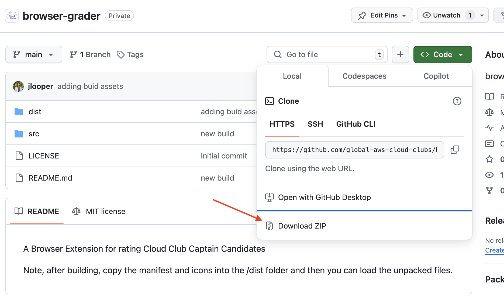
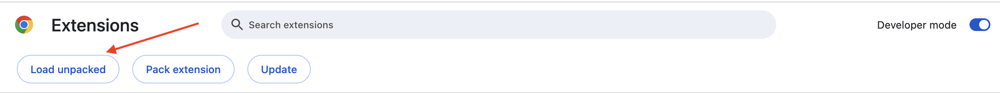
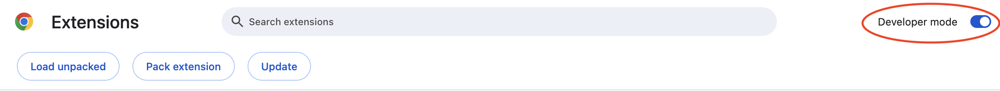
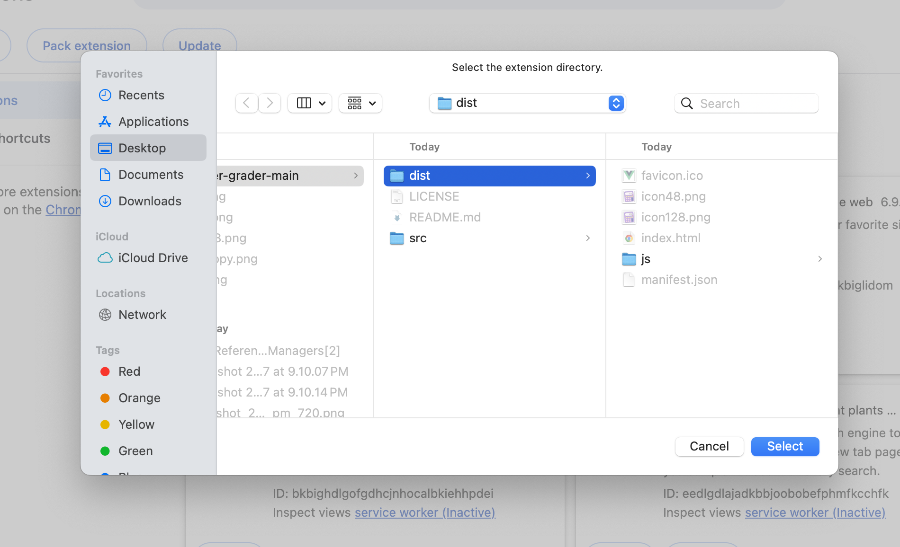
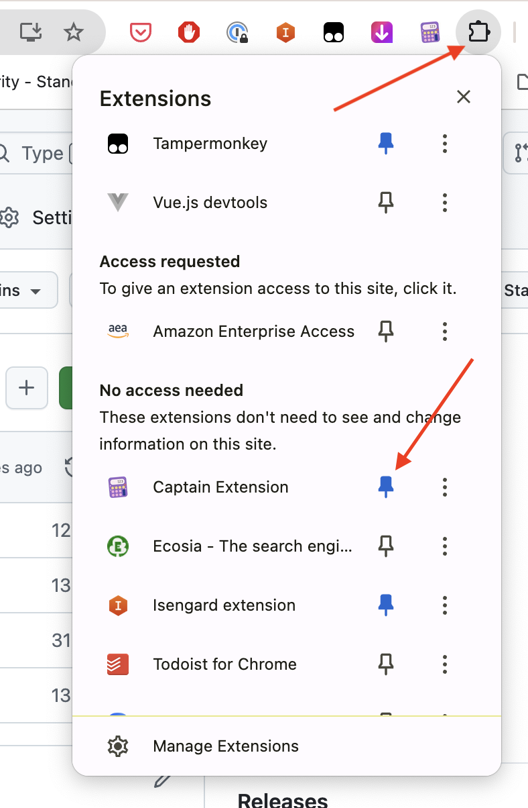
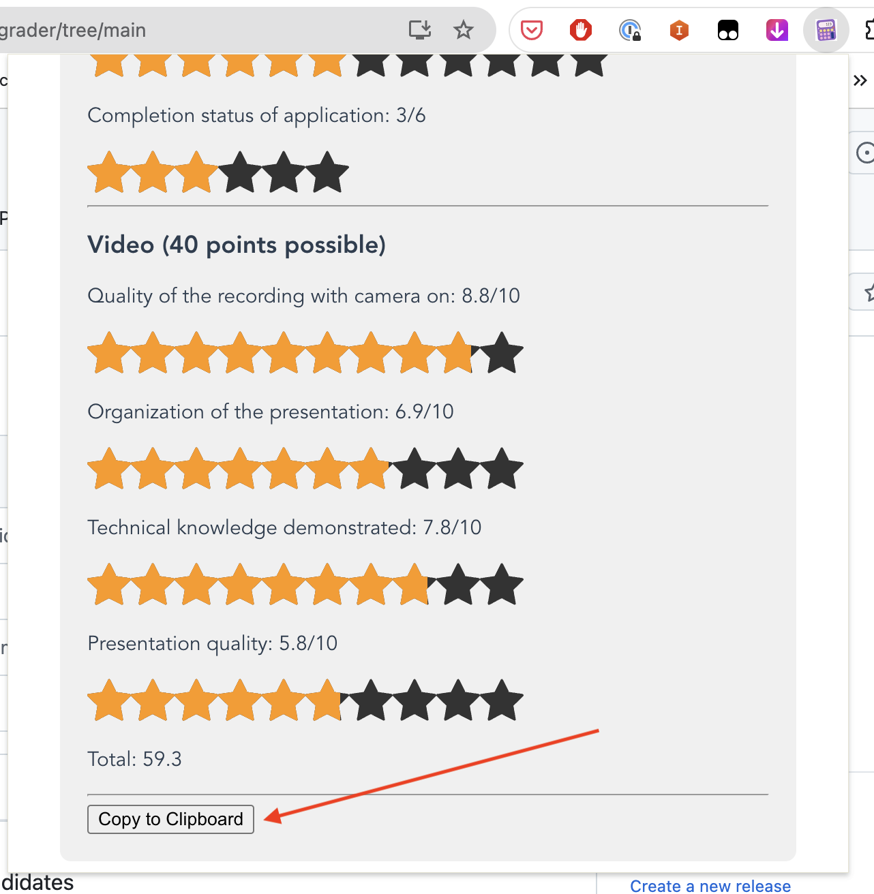

## A Browser Extension for rating Cloud Club Captain Candidates

How to install

Step 1: Download the contents of this repository to your desktop

Step 2: Go to chrome://extensions/ in your browser

Step 3: Make sure "Developer Mode" is toggled on

Step 3: Click "Load Unpacked"

Step 4: Select the 'dist' folder to load the extension

Step 5: Click the 'extensions' icon in your browser and then pin the extension to your browser toolbar so you can open it easily. The extension is now usable for each Pulse submission.

Step 6: Use the extension by selecting the appropriate star value for each element, and click the bottom button to copy your grading decision into each Pulse submission in the comments.

